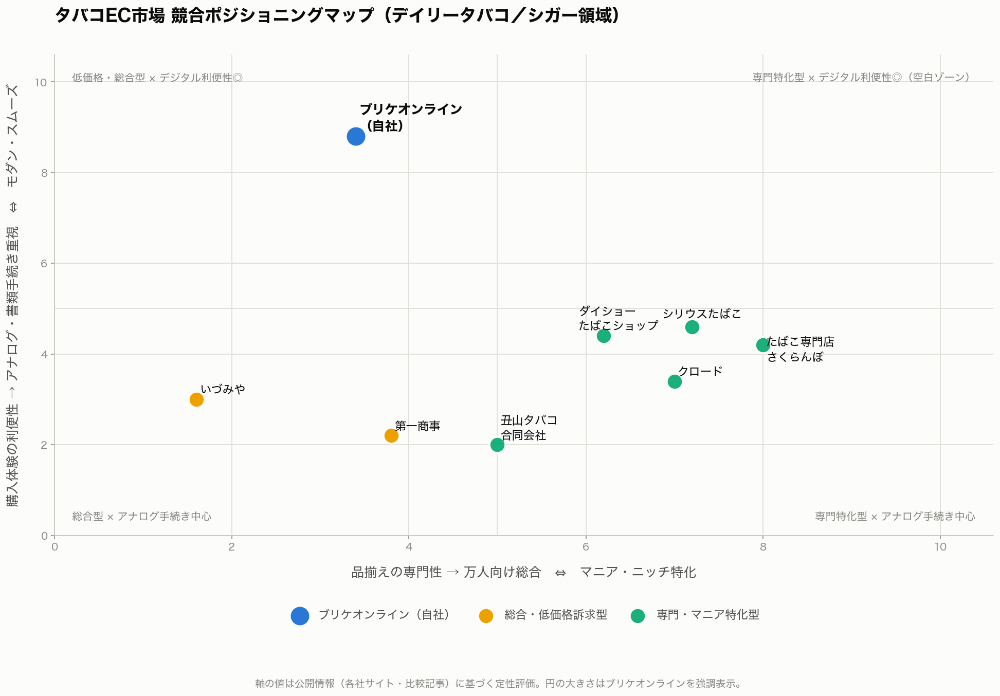

# タバコEC市場 競合ポジショニングマップ（ブリケオンライン）

## 概要

タバコEC市場（デイリータバコ／シガー領域）の主要8サイトを比較し、ブリケオンラインの
立ち位置と差別化ポイントを整理した。軸は「品揃えの専門性」と「購入体験の利便性」の
2軸。出典は各社公式サイトおよび比較記事（relazo.net「タバコ通販おすすめ8選」等、
2026年8月時点の公開情報）。

## ポジショニングマップ

## 競合8サイトの特徴

| サイト | 主な取扱い | 決済・年齢確認 | 特徴 |
| --- | --- | --- | --- |
| **ブリケオンライン（自社）** | 紙巻き・加熱式・シガー＋喫煙具・お酒・コーヒー定期便 | クレカ／PayPay／代引、免許証・マイナンバーカード自動読取 | 実店舗カフェ「SMOKERS' CAFE BRIQUET」、コラム・コンテンツ発信、3営業日以内発送 |
| いづみや | 紙巻き・加熱式・パイプ・シガー | 銀行振込のみ | 送料最安（¥200〜）。低価格・総合型 |
| 第一商事 | 国内外紙巻き・加熱式・シガー200種以上 | 銀行・郵便振替 | 送料¥800〜とやや高め。総合型だが手続きはアナログ |
| クロード | 紙巻き・プレミアムシガー・シガリロ・レア銘柄 | 銀行振込のみ | 世界各国のたばこ品揃えに定評。専門特化型 |
| ダイショーたばこショップ | 紙巻き・加熱式・手巻き・シガー1,500種以上 | 銀行振込・代引（クレカ不可） | 品揃え最大級。初心者〜愛煙家まで対応 |
| 丑山タバコ合同会社 | 紙巻き・加熱式（カートン単位） | 代引のみ | 鮮度への徹底したこだわりが差別化軸 |
| シリウスたばこ | 紙巻き・加熱式・パイプ1,000種以上 | 銀行振込・代引 | 「シリウス文庫」等のコンテンツ・コミュニティ機能。最低注文¥4,500 |
| たばこ専門店さくらんぼ | 紙巻き・加熱式・レア輸入銘柄・パイプ・嗅ぎたばこ600種以上 | 銀行振込・代引 | レビュー・世界のたばこ屋紀行記事でストーリー訴求。最低注文¥4,000 |

## セグメント別の見立て

- **デイリータバコ（紙巻き・加熱式）**：いづみや・第一商事など「送料の安さ」で戦う
  低価格勢と、ダイショー・シリウスなど「品揃えの広さ」で戦う専門勢に分かれる。
  ブリケオンラインは価格・品揃えの尖りでは競らず、**年齢確認や決済のスムーズさ
  （PayPay・自動ID読取）**で日常使いのハードルを下げる方向に立つ。
- **シガー（葉巻）**：クロード・さくらんぼ・世界のたばこ通販などが「レア銘柄・国際色」
  を軸にした専門店として先行しており、品揃えの深さでは正面から戦いにくい領域。
  ブリケオンラインは主戦場のシガーラインを「気軽に試せる」「決済・受け取りが簡単」
  という購入体験面の差別化で補完する形が現実的。
- **3つ目のセグメント「シュメディオ」**：この用語に一致する公開情報が見つからなかった。
  依頼文からの想定候補と、それぞれの場合の分析の方向性を以下に示すので選択してほしい。
  - [ ] **喫煙具・周辺アイテム／ライフスタイル商材**（ライター・お酒・コーヒー定期便等、
    ブリケオンラインが実際に展開中の周辺物販）として分析する
  - [ ] **手巻きたばこ（シャグ）**セグメントとして分析する（表記ゆれの可能性）
  - [ ] 他の意味（用語・表記を教えてほしい）
  - 回答後、該当セグメントのポジショニングを追加する。

## ブリケオンラインの差別化ポイント（まとめ）

1. **購入体験の利便性が突出**：運転免許証・マイナンバーカードの自動読取による
   年齢確認、PayPay・代引を含む決済の柔軟性は、銀行振込のみの競合（いづみや・
   クロード・第一商事など）に対する明確な優位点。
2. **オンライン×リアルの二重接点**：実店舗「SMOKERS' CAFE BRIQUET」を持つのは
   競合8社中ブリケオンラインのみ。ECで完結せず、喫煙者コミュニティの場を提供できる。
3. **カテゴリ横断のライフスタイル提案**：たばこ単体ではなく、お酒・コーヒー定期便・
   ブランド雑貨まで扱う点は、シリウスたばこの「コンテンツ訴求」とは異なる
   「隣接消費の取り込み」型の差別化。
4. **空白ゾーンが存在**：「専門特化型 × デジタル利便性が高い」の象限（マップ右上）
   は現状どのサイトも埋めておらず、シガーなど専門性の高いラインをブリケオンラインの
   利便性の強みで拡張できれば、競合が手薄な領域を取りに行ける。

## 前提・限界

- 座標は各社サイト・比較記事から読み取れる特徴に基づく定性評価であり、売上規模や
  会員数などの定量データは含まない。
- 「シュメディオ」セグメントは上記の通り解釈待ちのため、現時点の分析は
  デイリータバコ・シガーの2セグメントを中心に構成している。
